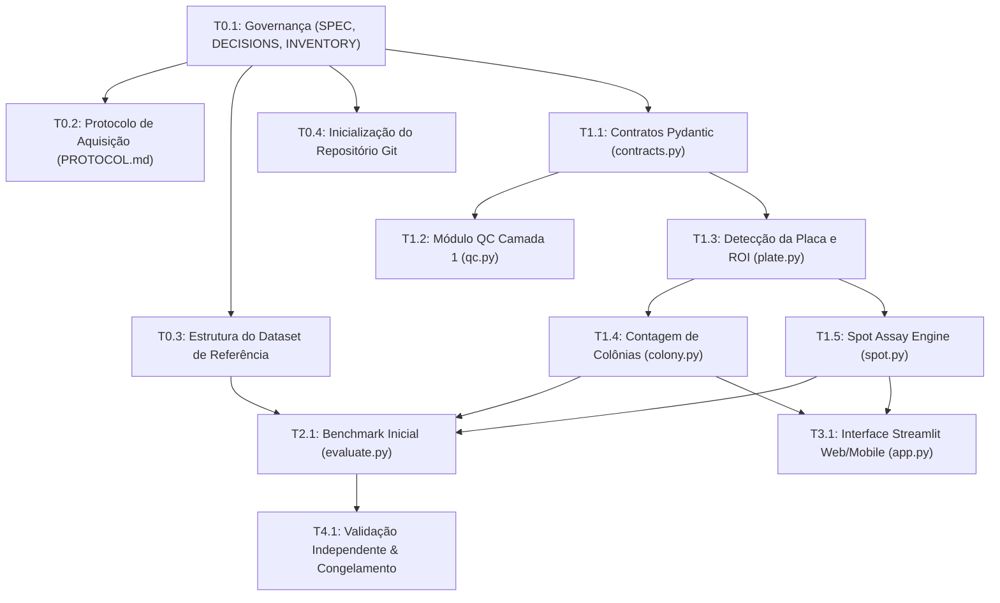

# SPEC.md — YeastPlate Analyzer (Especificação Técnica e Contratos de I/O)
*Versão:* 2.0.0  
*Última Atualização:* 2026-09-30  
*Status:* Aprovado com Ressalvas (Revisão 2)  
*Ecossistema de Execução:* Multi-agente (Antigravity IDE local + Google Jules Cloud + Desenvolvedor Humano)

---

## 1. Visão Geral e Princípios Científicos

O **YeastPlate Analyzer** é um sistema de software científico projetado para a detecção, segmentação e quantificação automatizada de ensaios de leveduras (*Saccharomyces cerevisiae*) em placas de Petri sólidas com meios **YPD**, **YPGal** e **YPGly**, inclusive sob condições de estresse (ex.: cloreto de lítio - LiCl, osmótico, oxidativo ou térmico).

### Princípios Inegociáveis (Revisão 2)
1. **Automação como fluxo principal:** Detecção de placa, controle de qualidade (QC), quantificação e exportação executados ponta a ponta sem intervenção manual obrigatória.
2. **Revisão humana por exceção:** O usuário só é chamado a intervir em placas sinalizadas pelo QC com baixa confiança ou artefatos severos.
3. **Placa limpa como caso-padrão:** O pipeline central é otimizado para placas limpas sem fita ou caneta. Presença de caneta piloto ou fita crepe pertence à suíte de testes de estresse/robustez, nunca ditando o desenho do pipeline principal.
4. **Veto à falsa precisão:** É proibido estimar biomassa absoluta a partir de intensidade sem calibração fotométrica. É proibido inventar informação biológica em áreas obstruídas via *inpainting*. Regiões inconclusivas devem ser marcadas como `UNQUANTIFIABLE`.
5. **Rastreabilidade e Determinismo:** Cada execução registra o hash SHA-256 da imagem original, versão do software, parâmetros utilizados e fixação estrita de sementes aleatórias (`seed=42`).

---

## 2. Matriz de Tarefas e Dependências entre Agentes

Esta matriz governa a ordem de execução para que múltiplos agentes (Antigravity, Jules) possam trabalhar de forma assíncrona sem quebrar dependências.



| ID | Nome da Tarefa | Entradas | Saídas Esperadas | Agente Recomendado | Status |
| :--- | :--- | :--- | :--- | :--- | :--- |
| **T0.1** | Governança Base | Diretrizes Rev. 2 | `SPEC.md`, `DECISIONS.md`, `INVENTORY.md` | Antigravity | **Concluído** |
| **T0.2** | Protocolo Fotográfico | Boas práticas microbiológicas | `PROTOCOL.md` | Antigravity | **Em andamento** |
| **T0.3** | Dataset de Referência | Amostras locais | `reference_dataset/` estruturado + `metadata_template.json` | Antigravity | **Em andamento** |
| **T0.4** | Versionamento Git | Workspace | Repo Git inicializado com `.gitignore` | Antigravity | **Concluído** |
| **T1.1** | Contratos de Dados | `SPEC.md` | `yeast_vision/contracts.py` (Pydantic v2) | Antigravity | Pendente |
| **T1.2** | QC Camada 1 | Imagem RGB/RAW | `yeast_vision/qc.py` (Laplacian, saturação, corte) | Antigravity / Jules | Pendente |
| **T1.3** | Detector de Placa | Imagem + QC aprovado | `yeast_vision/plate.py` (Máscara elíptica/circular adaptativa) | Antigravity / Jules | Pendente |
| **T1.4** | Modo 1: Colônias | Placa isolada | `yeast_vision/colony.py` (Watershed float32, UFC/mL) | Antigravity / Jules | Pendente |
| **T1.5** | Modo 2: Spot Assay | Placa isolada | `yeast_vision/spot.py` (Grade, sinal integrado, diluição) | Antigravity / Jules | Pendente |
| **T2.1** | Benchmark de Baselines | Reference dataset | `benchmarks/report_baseline.json` | Antigravity | Bloqueado por T1.4/5 |
| **T3.1** | Interface Streamlit | Módulos `yeast_vision` | `app/main.py` com suporte a mobile browser | Antigravity / Jules | Bloqueado por T1.4/5 |
| **T4.1** | Validação Independente | Test dataset congelado | Relatório de validação com ressalvas científicas | Antigravity | Bloqueado por T2.1 |

---

## 3. Contratos de Entrada e Saída (Pydantic Schemas)

Todos os módulos do pacote `yeast_vision` comunicam-se obrigatoriamente através dos seguintes schemas estritos, garantindo tipagem estática e serialização JSON determinística.

### 3.1 Metadados Experimentais (`ImageMetadata`)
```python
from datetime import datetime
from enum import Enum
from typing import Optional
from pydantic import BaseModel, Field

class MediumType(str, Enum):
    YPD = "YPD"
    YPGAL = "YPGal"
    YPGLY = "YPGly"

class ExperimentType(str, Enum):
    COLONY_COUNT = "colony_count"
    SPOT_ASSAY = "spot_assay"

class ImageMetadata(BaseModel):
    image_id: str = Field(..., description="Identificador único (UUID ou hash SHA-256)")
    filename: str
    timestamp_capture: datetime
    medium: MediumType
    carbon_source_concentration_pct: float = Field(2.0, ge=0.1, le=10.0)
    stressor: Optional[str] = Field(None, description="Nome do composto, ex: LiCl, NaCl, H2O2")
    stressor_concentration_mM: Optional[float] = Field(None, ge=0.0)
    incubation_time_hours: float = Field(..., ge=0.0, le=168.0)
    temperature_celsius: float = Field(30.0, ge=15.0, le=45.0)
    strain_id: str = Field(..., description="Identificador da linhagem (ex: BY4741, W303, mutante)")
    plate_id: str
    experiment_type: ExperimentType
```

### 3.2 Controle de Qualidade da Imagem (`QCResult`)
```python
class QCStatus(str, Enum):
    PASSED = "passed"
    WARNING_REVIEW_REQUIRED = "warning_review_required"
    REJECTED_UNQUANTIFIABLE = "rejected_unquantifiable"

class QCResult(BaseModel):
    status: QCStatus
    blur_score_laplacian: float = Field(..., description="Variância do operador Laplaciano")
    fraction_saturated_pixels: float = Field(..., ge=0.0, le=1.0)
    fraction_underexposed_pixels: float = Field(..., ge=0.0, le=1.0)
    resolution_width_px: int = Field(..., ge=500)
    resolution_height_px: int = Field(..., ge=500)
    is_plate_fully_visible: bool
    rejection_reasons: list[str] = Field(default_factory=list)
```

### 3.3 Saída da Detecção da Placa (`PlateROIResult`)
```python
class PlateROIResult(BaseModel):
    center_x_px: float
    center_y_px: float
    radius_px: float
    exclusion_margin_pct: float = Field(8.0, ge=0.0, le=25.0, description="Margem periférica adaptativa")
    analyzable_area_px: int
    excluded_peripheral_area_px: int
```

### 3.4 Saída do Modo Contagem de Colônias (`ColonyCountResult`)
```python
class SingleColony(BaseModel):
    colony_id: int
    centroid_x_px: float
    centroid_y_px: float
    area_px: int
    circularity: float = Field(..., ge=0.0, le=1.0)
    solidity: float = Field(..., ge=0.0, le=1.0)
    mean_intensity: float
    is_manual_override: bool = False

class ColonyCountResult(BaseModel):
    total_colonies_auto: int
    total_colonies_final: int
    colonies: list[SingleColony]
    inoculated_volume_ml: Optional[float] = Field(None, gt=0.0)
    dilution_factor: Optional[float] = Field(None, ge=1.0, description="Ex: 1000.0 para 10^-3")
    cfu_per_ml: Optional[float] = None
    is_in_valid_counting_range: bool = Field(..., description="True se 30 <= N <= 300")
    execution_version: str
    random_seed: int = 42
```

### 3.5 Saída do Modo Spot Assay (`SpotAssayResult`)
```python
class SingleSpotMeasurement(BaseModel):
    row_idx: int
    col_idx: int
    strain_id: str
    dilution_factor: float = Field(..., ge=1.0)
    growth_detected: bool = Field(..., description="Métrica primária semiquantitativa")
    area_growth_px: int = Field(..., description="Área do spot de biomassa")
    background_corrected_signal: float = Field(..., description="Sinal integrado líquido em a.u.")
    is_saturated: bool
    confidence_score: float = Field(..., ge=0.0, le=1.0)

class SpotAssayResult(BaseModel):
    grid_rows: int
    grid_cols: int
    spots: list[SingleSpotMeasurement]
    max_dilution_with_growth_by_strain: dict[str, float]
    execution_version: str
    random_seed: int = 42
```

---

## 4. Definição Formal de Métricas e Regras de Agregação

### 4.1 Contagem de Colônias e $\text{UFC/mL}$
* **Critério de Faixa Válida:** Uma placa é classificada como estatisticamente confiável quando:
  $$30 \le N_{\text{colônias}} \le 300$$
  * Se $N < 30$: emitir sinalizador `TOO_FEW_TO_COUNT_LOW_STATISTICAL_POWER`.
  * Se $N > 300$: emitir sinalizador `TOO_NUMEROUS_TO_COUNT_CROWDING_RISK`.
* **Cálculo de UFC/mL:**
  $$\text{UFC/mL} = \frac{N_{\text{colônias}} \times \text{Fator de Diluição}}{V_{\text{inoculado}}\text{ (mL)}}$$
* **Agregação de Réplicas:** Quando houver réplicas técnicas na faixa de 30–300, a agregação utiliza a média ponderada microbiológica padronizada (ISO 7218):
  $$C = \frac{\sum N}{V \times (n_1 + 0.1\,n_2) \times d}$$

### 4.2 Spot Assay (Ensaio de Gota)
* **Métrica Primária (Semiquantitativa):** Maior diluição onde o crescimento foi detectável:
  $$\text{Score}_{\text{dil}} = \max \{ d \in \text{Diluições} \mid \text{growth\_detected}(d) = \text{True} \}$$
  O limiar de detecção é definido como:
  $$\text{Sinal}_{\text{médio\_spot}} > \text{Fundo}_{\text{ágar}} + 3 \times \sigma_{\text{ruído\_fundo}}$$
* **Medida Complementar:** Sinal integrado corrigido pelo fundo em unidades arbitrárias (a.u.):
  $$\text{Sinal Integrado} = \sum_{p \in \text{Spot}} \left( I(p) - I_{\text{fundo\_local}} \right)$$
  *É vedado denominar essa medida como Densidade Óptica (OD).*

---

## 5. Estratégias de Controle de Qualidade (QC)

### Camada 1 (Determinística — Implementação Imediata)
1. **Desfoque (Blur):** Calculado pela variância do Laplaciano da imagem em escala de cinza normalizada:
   $$\text{Var}_{\text{Lap}} = \operatorname{Var}(\nabla^2 I)$$
   Se $\text{Var}_{\text{Lap}} < 100$, marcar como `WARNING_BLURRY`.
2. **Saturação de Pixels (Over/Underexposure):**
   * Superexposição: Fração de pixels com intensidade $\ge 250$ no canal de luminosidade $> 5\% \implies$ `WARNING_OVEREXPOSED`.
   * Subexposição: Fração de pixels com intensidade $\le 15$ dentro da ROI $> 10\% \implies$ `WARNING_UNDEREXPOSED`.
3. **Resolução Mínima:** A imagem deve possuir no mínimo $1200 \times 1200$ pixels e a placa deve ocupar pelo menos $60\%$ do enquadramento.

### Camada 2 (Refinada com Benchmark — Etapa 2)
* Detecção de reflexos especulares em anel (glare do poliestireno).
* Detecção de condensação microgoticular na superfície do ágar.
* Detecção de inclinação de perspectiva excessiva ($> 15^\circ$).

---

## 6. Códigos de Erro e Sinalizadores Padronizados

| Código | Nível | Significado | Ação do Sistema |
| :--- | :--- | :--- | :--- |
| `QC_BLUR_EXCESSIVE` | Warning | Imagem fora de foco | Requer confirmação humana para prosseguir |
| `QC_PLATE_CLIPPED` | Error | Borda da placa cortada no enquadramento | Rejeita análise automática completa |
| `QC_SATURATION_HIGH` | Warning | Reflexo ou superexposição compromete área | Marca região saturada como `UNQUANTIFIABLE` |
| `COLONY_OVERSEGMENTATION_RISK` | Info | Muitas colônias contíguas com watershed denso | Recomenda inspeção visual do analista |
| `SPOT_GRID_AMBIGUITY` | Warning | Grade de gotas irregular ou incompleta | Solicita confirmação manual da matriz |
| `METADATA_INCOMPLETE` | Error | Falta linhagem, meio ou diluição | Bloqueia cálculo final de UFC/mL |

---

## 7. Convenções de Código e Protocolo de Handoff

* **Linguagem & Tipagem:** Python 3.10+ com *type hints* estritos em todas as funções públicas. Validação por `mypy` e linting por `ruff`.
* **Precisão Numérica:** Operações de intensidade devem converter imagens de `uint8` para `float32` normalizado $[0.0, 1.0]$ antes de multiplicações ou subtrações, prevenindo *overflow* e *underflow*.
* **Testes Automatizados:** Todo módulo novo deve conter testes unitários em `tests/` cobrindo casos nominais, casos de borda e rejeição de entradas inválidas com `pytest`.
* **Registro de Decisão Obrigatório:** Nenhuma mudança de arquitetura, threshold ou fórmula matemática pode ser commitada sem um registro correspondente em `DECISIONS.md`.
